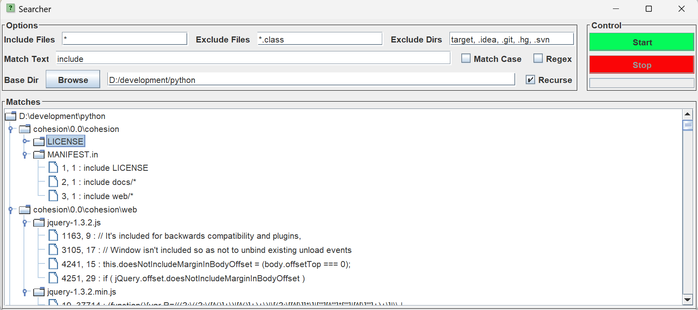

# SearcherSwing - A GUI file search utility

## Motivation

The motivation for this tool was to provide an easy way to search a large set of
unrelated programming projects for string matches and to provide an immediate view
of the matching context. While not necessarily as fast as complex multithreaded
search tools, it is reasonably performant and quite customizable.

## Background

A version of this tool was originally written in Python2 and wxWindows -
[Searcher](https://github.com/satyagraha/searcher) - but when
attempting to get it working on a recent macOS platform, this proved very
problematic with a lot of issues around the GUI library.

Hence, this project, which is a rewrite of the earlier project into Scala 3 with
a JVM Swing UI, should prove at least as portable.

## Requirements

For basic development, the application requires the following software components:

1. [IntelliJ Idea](https://www.jetbrains.com/idea/) - Community Edition is fine
2. Java 11 SDK (or compatible later release)

Alternatively, if you have a full Scala [SBT](https://www.scala-sbt.org/) development
environment and don't want to use IntelliJ, that's fine, you don't strictly need it,
you can build the runtime searcher jar with just SBT,
but you won't be able to amend the GUI.

## Getting Started

### Using IntelliJ

1. Clone this repository in the usual way.
1. Import the project using the SBT model option.
1. Go to _File > Settings_ and change the selection
   for _Editor > GUI Designer > Generate GUI_ into: _to Java source code_.
1. Should you make a GUI change, fully rebuild the project from IntelliJ to
   (re-)generate the GUI Java source code (_Build >> Rebuild Project_).
1. Execute _Build > Build Project_, which should complete successfully
1. Execute _Run_ > _Edit Configurations..._ and add a new _sbt task_ configuration
   with task `assembly`.
1. Run the new configuration, and it should report the creation of a
   `Searcher-x.y.z.jar` file.

### Using SBT

1. Clone this repository in the usual way.
1. Execute `sbt assembly`.
1. It should report the creation of a `Searcher-x.y.z.jar`.

### Starting the application

1. Run `java -jar /path/to/Searcher.x.y.z.jar`
1. Additional JVM arguments may be provided, as described below under
   [Configuration](#Configuration)

## Usage

Use the dialog at the top of the UI to navigate to a folder to search,
set a file pattern, set a search text value, and then press the _Start_ button to
commence searching.

Assuming matches are found, they appear in a tree view with three types of entry.
Directories are the first type, and have children which are files,
and the files have children which are line matches.

In the results tree, you can select a row and then click the right-hand (or equivalent)
mouse button to activate the context (pop-up) menu which will provide the following
options:

1. _Copy filename_ (to clipboard)
1. _Copy relative path_ (to clipboard)
1. _Copy full path_ (to clipboard)
1. _Edit_ (using configured editor)

The ordering of tree entries is notionally alphabetical, but is case-dependent if
the host OS filesystem is case-sensitive.

### Accelerator Keys

Some convenience keyboard accelerators are provided thus:

- _Enter_ - starts search
- _Escape_ - stops search

## Configuration

The searcher configuration mechanism is implemented by
[Typesafe Config](https://github.com/lightbend/config)
with the initial values set in project file `src/main/resources/reference.conf`
which is bundled into the assembled jar.

Individual parts of that file may be overridden in two main ways:

1. Via individual JVM properties, e.g. `java -Dui-preference.height=600 -jar ...`
2. Via an external file. e.g. `java -Dconfig.file=/my/overrides.conf -jar ...`

The OS command line to launch the text editor from the context menu may be set
via the properties under configuration key `io-preferences.editor-*`.

Given the above, it should not be necessary to amend the existing `reference.conf`
unless significant changes to the application are being developed.

## UI Look and Feel

Depending on the host OS, and selected JVM, it may be possible to customise the Searcher
UI look and feel via JVM property overrides,
see [Oracle L&F Tutorial](https://docs.oracle.com/javase/tutorial/uiswing/lookandfeel/plaf.html).

Overriding the configuration path `ui-preferences.font-scaling` is one further facility which
is useful just to increase the presented font size when using high resolution monitors.

## Principles of Operation

For those interested in the implementation, the Java/Scala packages and their
associated responsibilities are as follows:

- `app` - Top-level main program
- `engine` - UI tree file match event generator
- `helpers` - Pub-Sub event passing framework etc.
- `io` - Miscellaneous IO-related functionality
- `search` - File match event generator
- `ui` - Swing UI form layout (Java)
- `view` - Higher-level UI handling (Scala)

The main processing flow in this pub-sub framework is as follows:

1. The user presses the _Start_ button which results in a UI event being published
2. The `Ui` class subscribed to that event is triggered
2. The input form fields are validated
3. The `FileSearcher` class is initiated and generates file level match events
4. The `EngineEventGenerator` and `EngineStateManager` publish UI tree level match events
5. The `Ui` class subscribed to these events updates the `MatchesTree` UI component

The UI appearance itself is defined in the `MainWindow.form` file, which is
processed by the IntelliJ GUI Builder to generate the necessary Java Swing
code lines into `MainWindow.java` which perform the required form layout
initialisation at run-time.

## IntelliJ Notes

1. You may prefer the simplified package tree appearance shown if in
_Project_ > _Options_ > _Tree Appearance_ you deselect the _Flatten Packages_
entry, further background
[here](https://blog.jetbrains.com/scala/2020/11/26/enhanced-package-prefixes/).

## Possible To Do's

- Tabbing behaviour
- Case-insensitive tree node ordering
- Better icons
- Native L&F file browser dialog
- Replace println with logging
- Tests

## Acknowledgements

- The [FS2](https://fs2.io) Scala stream processing library is an exceptional
  contribution to the Scala ecosystem and has proved to be very useful here.
- The [Scala-Swing](https://github.com/scala/scala-swing) bindings, although
  not entirely complete, were very useful.

## History

1.0.0 Initial version
